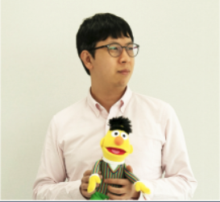

       

|번호|발표 유형|이름|소속|제목|발표 소개 및 자료|
|:--------:|:-----------------:|:-----------:|:--------:|:--------:|
|1|오거나이저|송영숙|경희대학교|밀려오는 자연어 데이터 파도 타기|자연어처리에 진입하는 사람들을 위해 필요한 데이터 및 강의, 서적 등에 대한 소개와 경험 공유|[발표 자료](./data/song_langcon.pdf)|
|2|스피커|문상환|Tokyo Institute of Technology 정보이공학원|한국어 토크나이징의 현재와 미래|-|-| 
|3|스피커|문지형|UPSTAGE|Korean Language understanding Evaluation(KLUE) Benchmark|-|-| 
|4|스피커|송치성|바벨피쉬|말로 하는 감정 인식|-|-|   
|5|스피커|조원익|서울대학교 전기정보공학부|kosp2e – 공개 가능한 한국어 음성 번역 코퍼스 구축기|현재 음성 번역 연구는 대부분 영어 및 인구어 중심의 음성을 기준으로 하여 진행되고 있고, 한국어는 주로 번역 대상 텍스트로 등장한다. 하지만 한국어의 음성을 다른 언어로 번역해야 하는 상황 역시 존재하며, 비디오 번역 혹은 여행 동시통역 등을 위해서는 그러한 시스템이 더욱 요구된다. 이러한 필요성에 따라 한국어의 음성 번역을 학습 및 평가할 수 있는 데이터셋을 제작하게 되었고, 이를 공개 가능하게 만드는 과정에서 느낀 점들을 공유한다.|[발표 자료](./data/kosp2e.pdf)|          
|6|스피커|김성동|NAVER AI|Scalable Dialogue System|목적 지향형 대화는 여러 가정 위에 정의된 태스크입니다. 이러한 가정들 탓에 때론 확장성이 떨어지기도 합니다. 본 발표에서는 대화 데이터 생성을 통해 효과적으로 대화 시스템을 확장하는 방법에 대해 소개합니다.|-|            
|7|스피커|박성준|KAIST 전산학부|Natural Language Processing for Computational Psychotherapic Applications|-|-|        
|8|스피커|김수환|TUNiB|한국어 음성 인식 : KoSpeech 개발기부터 OpenSpeech 개발기까지|음성인식을 처음 접하는 분들 혹은 이제 막 공부하는 분들을 위한 간단한 이론 설명 및 KoSpeech & OpenSpeech를 이용한 한국어 음성 인식기 학습 방법 소개|-|            
|9|스피커|고현웅|TUNiB|Parallelformers: 빅모델 배포를 향한 여정|-|[발표 자료](./data/Parallelformers_Langcon.pdf)|         
|10|튜토리얼|박조은|오늘코드|연합뉴스 타이틀 주제 분류|텍스트 분석을 처음 시작하는 입문자를 위한 튜토리얼 입니다. 파이썬을 통해 텍스트를 가져와 토큰화와 임베딩을 해보고 간단하게 머신러닝을 통해 텍스트 분류를 예측해 봅니다.|-|   
|11|튜토리얼|김지은|fast.ai KR|연합뉴스 타이틀 주제 분류|-|-|       
       

# 행사 진행

|:--------:|:-----------------:|:-----------:|
|송영숙||송치성|이재석|박신홍

