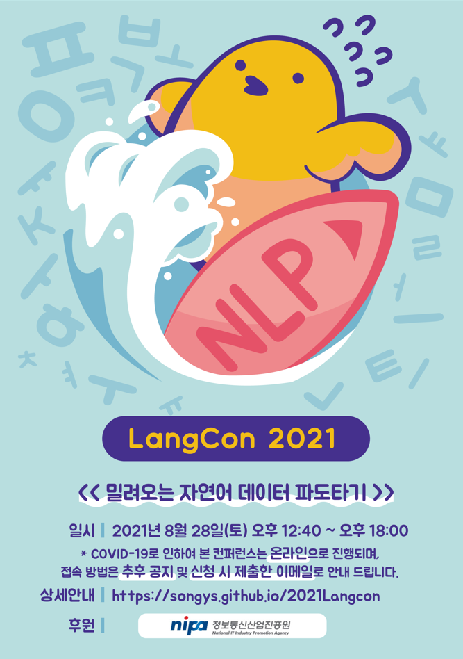

"제목"을 클릭하시면 발표 자료를 보실 수 있습니다.
       

|번호|발표 유형|이름|소속|제목|발표 소개|제목|발표 자료|
|:--------:|:-----------------:|:-----------:|:--------:|:--------:|:--------:|
|1|스피커|문상환|Tokyo Institute of Technology 정보이공학원|한국어 토크나이징의 현재와 미래|현재 음성 번역 연구는 대부분 영어 및 인구어 중심의 음성을 기준으로 하여 진행되고 있고, 한국어는 주로 번역 대상 텍스트로 등장한다. 하지만 한국어의 음성을 다른 언어로 번역해야 하는 상황 역시 존재하며, 비디오 번역 혹은 여행 동시통역 등을 위해서는 그러한 시스템이 더욱 요구된다. 이러한 필요성에 따라 한국어의 음성 번역을 학습 및 평가할 수 있는 데이터셋을 제작하게 되었고, 이를 공개 가능하게 만드는 과정에서 느낀 점들을 공유한다.|[발표자료]|
|2|스피커||문지형|UPSTAGE|[Korean Language understanding Evaluation(KLUE) Benchmark[발표 자료||
|3|스피커|송치성|NC SOFT)||말로 하는 감정 인식|발표 자료| |           
|4|스피커|조원익|서울대학교 전기정보공학부||kosp2e – 공개 가능한 한국어 음성 번역 코퍼스 구축기|[발표 자료](./data/kosp2e.pdf)|          
|5|스피커|김성동|NAVER AI||Scalable Dialogue System|발표 자료| |           
|6|스피커|박성준|KAIST 전산학부||Natural Language Processing for Computational Psychotherapic Applications|발표 자료||         
|7|스피커|김수환|TUNiB||한국어 음성 인식 : KoSpeech 개발기부터 OpenSpeech 개발기까지|발표 자료||             
|8|스피커|고현웅|TUNiB||Parallelformers: 빅모델 배포를 향한 여정|발표 자료| |           
|9|튜토리얼|박조은|오늘코드||연합뉴스 타이틀 주제 분류|발표 자료| |           
       

# 행사 진행

|:--------:|:-----------------:|:-----------:|:--------:|
|이재석|박신홍|송치성

