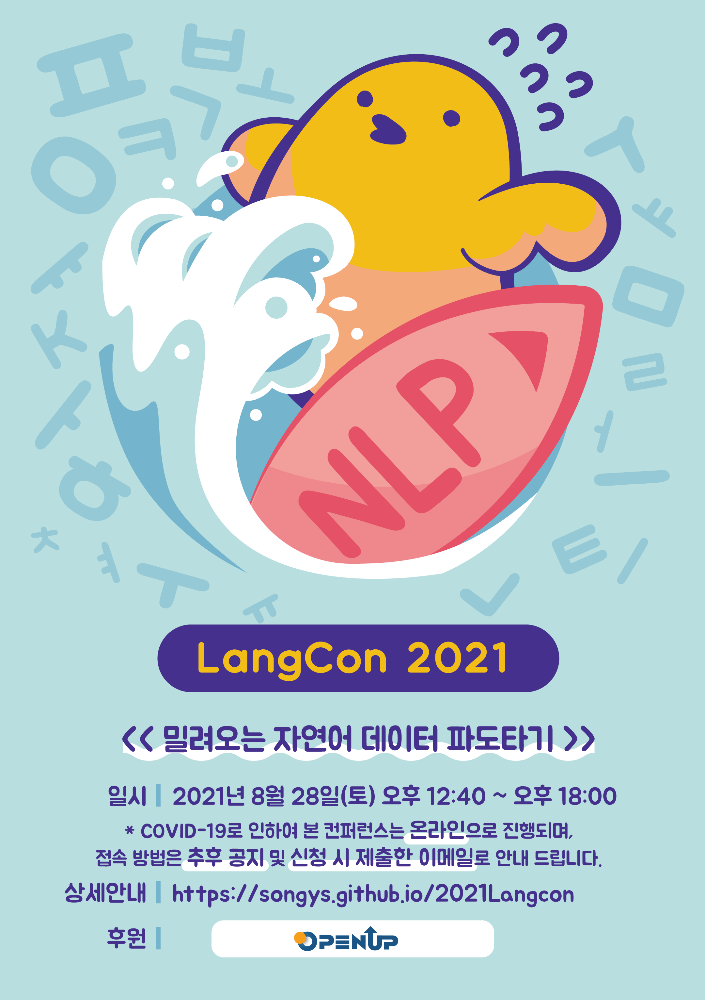
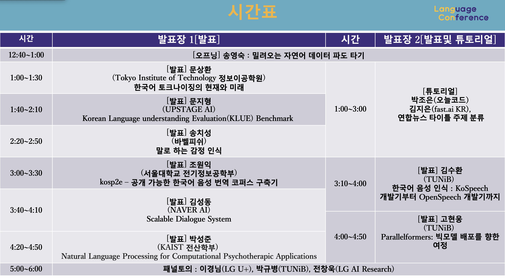

---
# Feel free to add content and custom Front Matter to this file.
# To modify the layout, see https://jekyllrb.com/docs/themes/#overriding-theme-defaults

layout: home
---

                  

 

#  2021/8/28(토)                             
                       
     
                       

# 온라인 모임
참여 신청하신 분들께 메일을 통해 줌 링크 또는 유튜브 라이브 링크를 전달드릴 예정입니다.         

# 지난 대회 보기          
[멜팅팡_연합세미나](https://www.onoffmix.com/event/110570)                   
[사람이 챗봇을 만듭니다!](https://www.onoffmix.com/event/124842)            
 >[발표 동영상](https://www.youtube.com/playlist?list=PLqkITFr6P-oRQu0OJCIqHuff-ubbCkWlL)                   

[봇봇봇](https://www.onoffmix.com/event/89407) 

[2019Langcon](https://songys.github.io/2019LangCon/)           
>[발표 동영상](https://www.youtube.com/playlist?list=PLqkITFr6P-oSpBGJY4ZW0hBDW6wd_a8gG)       
              
[2020Langcon](https://songys.github.io/2020LangconOnOff/)    
>[발표 동영상](https://www.youtube.com/playlist?list=PLqkITFr6P-oRTpBB7GZB7zRq70RQ4Brqt)       

## 질문을 남기시려면 이 [링크](https://forms.gle/BjqLLcLKsC4GUPzq6)를 클릭해 주세요.

## 참여방법 : [festa.io](https://festa.io/events/1747) 에서 참여신청해 주신 분들께 이메일을 통해 줌 링크를 전달해 드립니다. 발표세션 1은 [이 링크](https://youtu.be/Jzez288qOaI)를 통해 유튜브 라이브 스트리밍으로 보실 수 있습니다.     

# 후원                       

[Open Up](https://www.oss.kr/oss_intro)            

 

